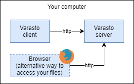

Glossary
--------

| Term | Explanation |
|------|-------------|
| Collection | Like a Git repository - stores concrete files and folders. Files consist of multiple blobs. Collections are change tracked by changeset, so if you accidentally deleted or modified a file you can go back in history to restore the file at a specific time. |
| Directory | Collections are stored in a hierarchy of directories. This is only in metadata sense - directory hierarchy of collections is different than directories inside collections. |
| Blob | Each file is split into 4 MB chunks called blobs. A blob is identified by its content's sha-256. A blob is stored in 1 or more volumes for redundancy. |
| Volume | A place to store blobs in. A single physical disk, Google Drive, AWS S3 etc. Volume is a more suitable term than "Disk" because cloud services aren't disks. |
| Mount | Volume is mounted in a given server, so the server has access to the volume's blobs. Depending on blob driver, same volume can be accessed from multiple servers. |
| Blob driver | Implements access to different types of volumes. `local-fs` stores blobs in local filesystem. `googledrive` stores in Google Drive etc. |
| Server | An instance of Varasto server running on a computer. You can run a cluster of Varasto servers for redundancy and/or convenience (think Varasto running behing firewall at home but also in cloud for remote access). |
| Clone | The act of downloading a collection to your computer for modifying it. Only reading files does not necessarily require cloning as you can stream videos/audio/photos off of Varasto's UI. |
| Push | The act of committing your local changes in a changeset and pushing that changeset to the Varasto server |
| Changeset | A group of changes to multiple files recorded in a single point in time. |

Architecture
------------

### Client vs. server

Varasto has a server and a client component:

| Component      | What it does                                              | Dropbox analogy |
|----------------|-----------------------------------------------------------|-------------------------|
| Varasto server | Manages storing of the data and showing the UI            | Dropbox service/server software |
| Varasto client | Used by your devices (PC, phone etc.) to access the data stored in Varasto server | Dropbox client software |
| Browser        | You can also access Varasto server UI without the client  | Access your files via dropbox.com |

In the simplest case you have the server and a client running on the same computer:

### Drawing

### Content-addressable storage

Varasto is backed by a
[Content-Addressable Storage](https://en.wikipedia.org/wiki/Content-addressable_storage)
(CAS), which provides quite a few tricks like automatic integrity protection and deduplication.

To learn more about how Varasto stores files:
[read more](../storage/local-fs/index.md#more-details-for-nerds).

Ideas
-----

- "[RAID is not a backup](https://serverfault.com/questions/2888/why-is-raid-not-a-backup)",
  so you would need backup in addition to RAID anyway. But what if we designed for backup
  first and its redundant storage as the primary source of truth?
- Varasto works like GitHub, with your different directories being like GitHub repos,
  (we call them collections) but with Varasto making automatic commits (= backup interval)
  against them. If you accidentally delete a file, you will find it from a previous
  collection revision. You can "clone" collections you want to work on, to your computer,
  and when you stop working on them you can tell Varasto to delete the local copy and
  Varasto client will ensure that the Varasto server has the latest state before removing.
  This way your end devices can remain almost-stateless. Store locally only the things you
  are working on currently!
- You don't need to clone collections if all you want to do is view files (such as look at
  photo albums, listen to music or watch movies) - Varasto supports streaming too.
- Data integrity is the most important thing. Hashes are verified on writing to disk and on
  reading from disk. There is also a scheduled job for checking integrity of your volumes.
- Unified view of all of your data - never again have to remember which disk a particular
  thing was stored on! Got 200 terabytes of data spread across tens of disks? No problem!
- Decoupling metadata from file content. You can move/rename files and folders and modify
  their metadata "offline", i.e. without touching the disk the actual file content is hosted on.
- Configurable encryption. Each collection could have a separate encryption key, which itself
  is asymmetrically encrypted by your personal key which never leaves your hardware security
  module. This way if a hacker MITM's or otherwise learns of a collection-specific
  decryption key, she can't access your other collections. Particularly sensistive collections
  could have such an encryption key even on a file-by-file basis.
- Related to previous point, we should investigate doing as much as possible in the client
  or the browser, so perhaps the decryption keys don't even have to be known by the server.
- Configurable replication policies per collection. Your family photo albums could be
  spread on 2 local disks and 1 AWS S3 bucket, while a movie you ripped from a Blu-ray could
  be only on one disk because in the event of a disk crash, it could be easily recreated.
- Accesses your files by using platform-specific snapshotting
  (LVM on Linux, shadow copies on Windows)
- Kind of like Git or Mercurial but for all of your data, and meant to store all of your
  data in collections (modeled as directories). Version control-like semantics for
  collection history, but "commits" are scheduled instead of explicit. This is meant to
  back up all your data and backups are useless unless they are automated.
- By not operating on (lower) block device level we don't need the complexity of RAID or
  specialized filesystems like ZFS etc. We can use commodity hardware and any operating
  system to reach the desired goals of integrity and availability. If your hard drive ever
  crashes, would you like to try the recovery with striped RAID / parity bits on a
  specialized filesystem, or just a regular NTFS or EXT4?
