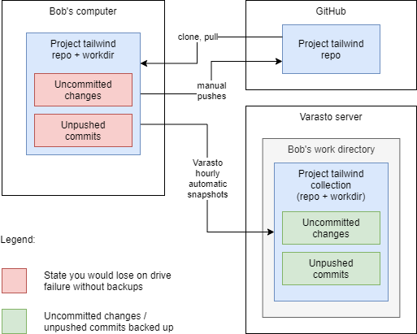

Varasto is great for storing any type of file, whether they're large or small files.

Screenshot from web UI
----------------------

Automatic backups
-----------------

Each time you change a file in Varasto, its previous version is also stored so you can
always recover from accidental modifications or deletions.

Varasto breaks files down to smaller chunks so if you only change part of a large file, the
entire file will not be stored twice.

Software projects
-----------------

Even though Varasto collections work similar to a Git repository (changesets, cloning etc.),
Varasto is not meant to replace software revision control - they can coexist peacefully and
augment each other.

Some people think of e.g. GitHub as a type of backup - and it kind of is, because if your
drive fails, a copy exists at a remote server that you can download ("clone") to your new
drive again. But there is a non-insignificant window of time where you can lose data:

To summarize:

| System  | Commit/push interval     | Window of losing data         |
|---------|--------------------------|-------------------------------|
| Git     | Whenever user decides to | Undefined - may be large      |
| Varasto | Automatic (maybe hourly) | Hour (or whatever configured) |
