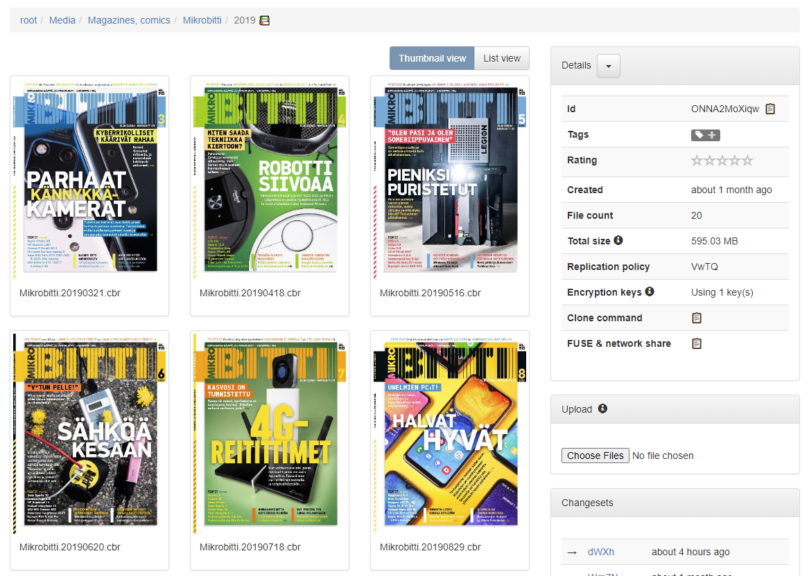

Screenshot
----------

Varasto automatically shows thumbnails for
[.cbz, .cbr](https://wiki.mobileread.com/wiki/CBR_and_CBZ) and `.pdf` files:

No configuration
----------------

!!! info "Ready out-of-the-box"
	There is nothing you need to configure.

Reading
-------

Varasto doesn't implement reading - all it does is display the thumbnail. You can use any
reader apps you're used to, to open the files.

