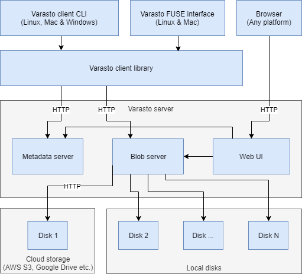
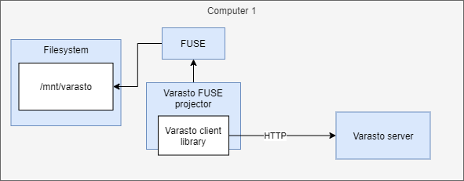
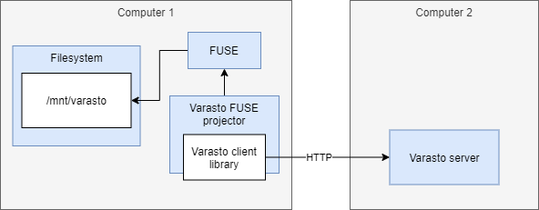

Motivation
----------

You'll see all of Varasto's content like it was your local filesystem, and it doesn't use
storage space as the files will be streamed on-demand.


OS support
----------

| Component              | Linux | Windows | macOS | Android, iOS |
|------------------------|-------|---------|-------|--------------|
| Varasto FUSE projector | ☑    | ☐      | ☐    | ☐           |


Architecture
------------

Varasto uses Linux-specific technology called
[FUSE](https://en.wikipedia.org/wiki/Filesystem_in_Userspace) to *project* content in Varasto
as a local directory hierarchy.

??? info "Varasto architecture drawing"
	

From above drawing, you'll see that the FUSE interface is **built on top of** the Varasto
client library, which talks to the Varasto server over HTTP. That means that if you want,
you can run the FUSE projector on a different computer than where the Varasto server runs.
This means that Varasto is great for corporate users where there's one central server (or
server cluster) that lets employees use files like if they were stored locally.

Here's how it looks if you run Varasto server and Varasto FUSE projector on:

=== "The same computer"
	

=== "Different computers"
	


Setting up FUSE projector on the same computer as Varasto server
----------------------------------------------------------------

Varasto can manage starting FUSE projector as a subsystem for you. Go to settings,
and make sure the FUSE projector subsystem is started.

!!! warning
	This feature is not yet completely ready - FUSE projector will crash if the client config
	file is not present. Read the "different computer than Varasto server" section for details,
	and you should read it anyway to gain more understanding.

!!! info
	If you're starting FUSE projector as a Varasto subsystem, you'll see the projector's logs
	from Varasto's `Settings > Logs`.

!!! tip
	If you're running Varasto in a Docker container, you need to bind mount the Varasto FUSE
	mountpoint from host to your container so the Samba process can benefit from the FUSE mount.


Setting up FUSE projector on a different computer than Varasto server
---------------------------------------------------------------------

This section and process needs cleaning up to make it easier for all users.

Currently I only have a few short pointers for more technical users:

You need to decide where you want the Varasto filesystem mountpoint be placed. In the above
drawing it's `/mnt/varasto` but you can use anything you want. Run `$ mkdir /mnt/varasto`.

Since Varasto FUSE projector is a client, we need to configure how to connect to the server.
Your config would look about like this:

```console
$ sto config-print
path: /home/joonas/varastoclient-config.json
{
	"server_addr": "https://localhost",
	"auth_token": "qZKcP...",
	"fuse_mount_path": "/mnt/varasto"
}
```

Note: `$ sto ...` commands unless prefixed with `$ sto server` are Varasto **client**
commands since you'll use the client more often.

You can run `$ sto config-init` to generate the config file.

For `auth_token` you need to create an API token in `Settings > Users`.

You need to run the projector manually by running `$ sto fuse serve`. TODO: systemd unit
file for automatically running it.


Testing that FUSE projector is working
--------------------------------------

Once you've started the FUSE projector, we should test that it works.

FUSE projector works like this: if you have a collection with ID `bmnpli5QXgc`, it can be
accessed over fuse at `/mnt/varasto/id/bmnpli5QXgc`.

Find a collection from Varasto's web UI to test with, and `$ cd` into that. FUSE projector
dynamically fetches the latest revision of that collection. You should see its files now.

If the above works, it's time to set up Samba.
