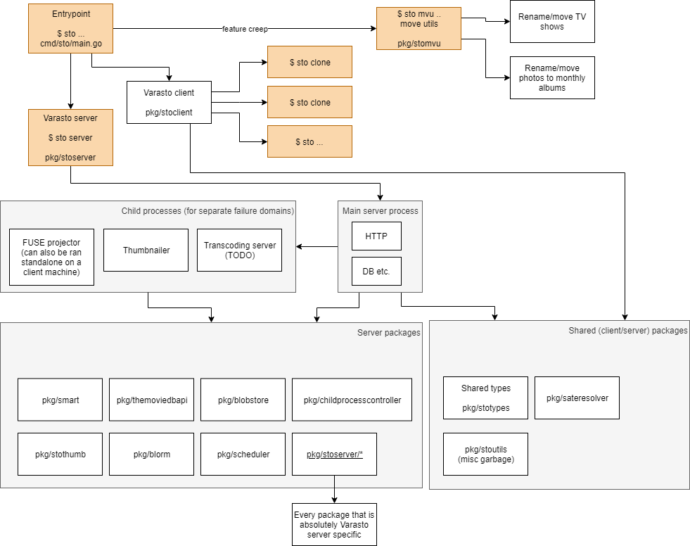
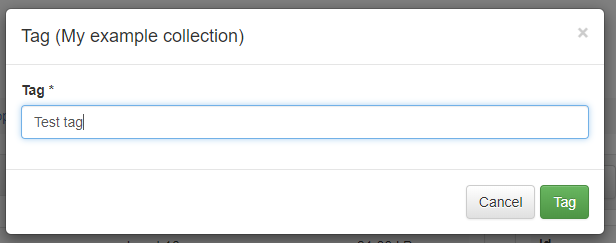

Codebase layout
===============

Drawing
-------

Example of implementing an entire feature
-----------------------------------------

To easier understand the codebase and its layout, let's look at a commit that implements
[adding tagging support to collections](https://github.com/function61/varasto/commit/5117244c57547f21b51cfa548151359ed436dd69).

Points of interest in the commit:

- `dbtypes.go` is the "column" in the database for keeping track of collection's assigned tags
- `types.json` shows the REST API model addition for adding `Tags []string` to both backend
  (Go) and frontend (TypeScript)
- `commands.json` adds the command for adding/removing tags:
  * backend/frontend REST endpoint struct
  * autogenerates modal dialog for the commands
- `commandhandlers.go` has the implementation for adding/removing tags from DB
- `CollectionPage.tsx` adds tag editor (add / view / remove tags) to UI (see fig. 1).
  "Add" and "remove" both invoke autogenerated modal dialog (see fig. 2).
- `collectiondropdown.tsx` adds "add tag" modal dialog to collection dropdown (see fig. 3)

Fig. 1:

Fig. 2:

Fig. 3:

