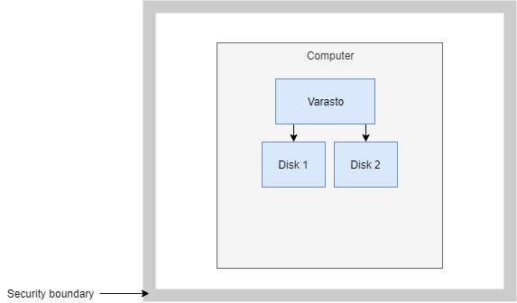

Summary
-------

Varasto has enough features for protecting against off-the-shelf ransomware and
even for protection against targeted attacks (= someone specifically understands and targets
your environment), but it is not "enabled by default" because you need to take specific
steps to enable the protection based on your tradeoffs - some steps cost money and some
steps cost convenience.

[Ransomware](https://en.wikipedia.org/wiki/Ransomware) has two different characteristics:

- Steal your files and threaten to make them public

- Block access for you to your own files by encrypting them and not giving you the key
  unless you pay a ransom

How Varasto protects from stealing files
----------------------------------------

Stealing files and threatening to make them public is addressed by Varasto's cryptosystem -
files on disk are garbage without having the encryption keys.

Varasto enables you to encrypt the encryption keys ("key encryption key") themselves in a
way that accessing each collection requires physical touch from a TPM module. Stealing your
files in a meaningful manner would therefore require decrypting the key encryption keys.

Use of TPM is not required and enabled by default, and will not come without usability
tradeoffs. It is up to you to consider the tradeoffs you want to make - but Varasto enables
you to have different key encryption keys with varying levels of security so the usability
tradeoffs can be reserved for only the sensitive data and not your meme collection.

How Varasto protects from blocking access to your own files
-----------------------------------------------------------

Cryptoransomware overwrites your files with encrypted versions of your files that only
the attacker has access to the decryption key for. Therefore the attack vector is
overwriting/deleting your file copies. In short, if the computer the attacker targets has
write access to all the copies of the data (even if you store the data on multiple disks),
you're well and truly fucked.

Here's a healthy environment:

Now it gets infected with ransomware:

It isn't much help if you've got two Varasto servers in same network if the ransomware
uses an exploit to take over the second server in the same network:

The trick to effective ransomware protection is to have at least one copy of your data
in a separate security boundary. By security boundary we mean that once data is written
to the disk in separate security boundary, it cannot be overwritten/deleted by the
ransomware - only appends should be possible.

One way to achieve overwrite/delete protection is to have a copy of your data on a cloud
disk that the infected computers don't have overwrite/delete access to. For example we
could host said files on AWS S3 and have Varasto servers have restricted access keys without
the ability to delete/overwrite data:

Read more about
[enabling ransomware protection for volumes hosted on S3](guide_setting-up-s3.md).

This isn't applicable to only S3 - the principle of having data in multiple security
boundaries holds with other services as well. Or if you're brave enough, you could have one
security boundary but running in a security-hardened node only runnning Varasto
(this is not recommended though).

How Varasto identifies a ransomware infection
---------------------------------------------

Identifying ransomware is noticed by our scheduled data scrubbing jobs because the job
reads all the blobs on the disk and if the cryptographic signature doesn't match, Varasto
knows the data is corrupted. But if you'll have an active system your users probably will
complain before a scheduled data scrubbing job runs about not being able to access
the data - Varasto won't even try serve incorrect data without reporting an error.
