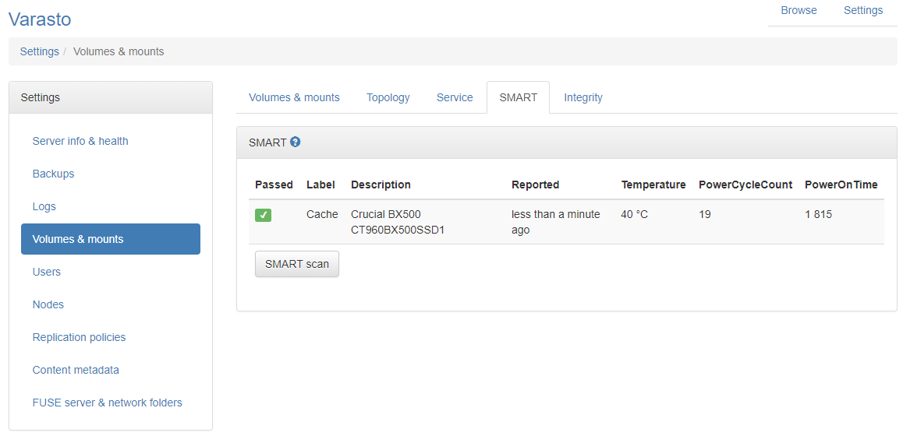

Setting up SMART monitoring
===========================

Motivation
----------

SMART can give warning signs of your storage device breaking before it totally fails.

You can also often get the temperature of the device so you can troubleshoot any airflow issues.

Screenshots
-----------

Supported OSes
--------------

Only Linux is supported for now, and even that requires Docker installation to pin the
[smartmontools](https://www.smartmontools.org/) version since we use JSON for easier
interop and the new version with JSON support doesn't seem to be in major Linux distros yet.

Configuration
-------------

Not all volumes can be checked for SMART data - cloud volumes and other external services
are one such example where the concept does not apply.

You have to specify "SMART ID" for each volume that supports polling their SMART data.

The "SMART ID" is an ID with which the SMART subsystem will identify the disk. In practice
it's the device path to the Linux block device like `/dev/sda`.

It's recommended to use paths under `/dev/disk/by-uuid/..` to explicitly specify which disk
you're referring to, since `/dev/sda` could very well be `/dev/sdb` on next boot.

You can enter "SMART ID" via `Settings > Volumes & mounts > (your disk) > Set SMART ID`.

Once you've entered the ID, the row doesn't automatically show up in the SMART tab - it only
shows up after the first SMART report is polled for this disk.

You can start poll from the SMART tab's "SMART scan" button - after that you should see the 
SMART data row and also now see the volume in server health page.
