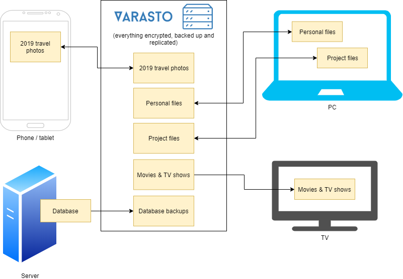

Vision
------

Video & screenshot introduction
-------------------------------

[Screenshots](screenshots/index.md) give you a great idea quickly. Also, a short
introduction video:

<iframe width="688" height="387" src="https://www.youtube.com/embed/qV7TdKnGSqk" frameborder="0" allow="accelerometer; autoplay; encrypted-media; gyroscope; picture-in-picture" allowfullscreen></iframe>

Features
--------

You get all of this for free:

|                             | Details                               |
|-----------------------------|---------------------------------------|
| Supported OSes              | [Almost everything: PCs, mobile devices (Android, iOS), Raspberry Pis etc.](#supported-oses) |
| Data privacy                | All data is encrypted - each collection with a separate key so compromise of one collection does not compromise other data. Take back ownership of your data. |
| [Data durability](using/replication-policies/index.md) | Transparently replicates your data to multiple disks / off-site storage. |
| [Data integrity](using/background-integrity-verification/index.md) | `SHA-256` hashes verified on file write/read - detects [bit rot](https://en.wikipedia.org/wiki/Data_degradation) immediately. We also have scheduled scrubbing to detect errors in the background before they affect you. |
| Data sensitivity            | You can mark different collections with different sensitivity levels and decide on login which sensitivity level content do you want to show. |
| Backup all your devices' data | Varasto's architecture is ideal for backing up all your PCs, mobile devices etc. |
| Supported storage methods   | Local disks or cloud services (AWS S3, Google Drive), all in encrypted form so you don't have to trust the cloud ("zero trust" model) or have data leaks if local disks get stolen. |
| [Data access methods](data-interfaces/index.md) | 1) Clone collection to your computer 2) Open/stream files from web UI 3) Via network folders 4) Linux FUSE interface |
| [Integrated metadata backups](using/metadata-backup/index.md) | Use optional built-in backup to automatically upload encrypted backup of your metadata DB to AWS S3. If you don't like it, there's interface for external backup tools as well. |
| Transparent compression     | Only well-compressible files will be automatically compressed |
| [Metadata support & tagging](content/movies/index.md) | Can use metadata sources for automatically fetching movie/TV series info, poster images etc. Can also add tags to collections. |
| All files in one place      | Never again forget on which disk a particular file was stored - it's all in one place even if you have 100 disks! Varasto is [dogfooded](https://en.wikipedia.org/wiki/Eating_your_own_dog_food) with ~50 TB of data without any slowdowns. |
| [Thumbnails for photos](content/photos/index.md) | Automatic thumbnailing of photos/pictures |
| [Health monitoring](screenshots/index.md#health-monitoring) | Get warnings or alerts if there is anything wrong with your volumes, data or Varasto. |
| [Per-collection durability](using/replication-policies/index.md) | To save money, we support storing important files with higher redundancy than less important files |
| Transactional               | File or group of files are successfully committed or none at all. Practically no other filesystem does this |
| [Ransomware protection](security/ransomware-protection/index.md) | Run Varasto on a separate security-hardened device/NAS to protect from ransomware, or configure replication to S3 ransomware-protected bucket |
| [Integrated SMART monitoring](using/smart-monitoring/index.md) | Detect disk failures early |

!!! tip
	See also: [Paid features](#paid-features)

Upcoming features
-----------------

These (also free) features are not ready, but are prioritized and on the roadmap:

|                      | Details                               |
|----------------------|---------------------------------------|
| [Thumbnails for videos](https://github.com/function61/varasto/issues/40) | Automatic thumbnailing of videos |
| [Video & audio transcoding](https://github.com/function61/varasto/issues/60) | Got movie in 4K resolution but your mobile device doesn't have the performance, resolution or network bandwidth to watch it? |
| [Atomic snapshots](https://github.com/function61/varasto/issues/75) | Uses LVM on Linux and shadow copies on Windows to grab consistent copies of files |
| [Tiered storage](https://github.com/function61/varasto/issues/53) | Use SSD for super fast data ingestion, and transfer it in background to a spinning disk |
| [Multi-user](https://github.com/function61/varasto/issues/39) | Have separate file hierarchies for your friends & family |
| File sharing         | Share your own files to friends |
| Offline drives       | We support use cases where you plug in a particular hard drive occasionally. Queued writes/deletes are applied when volume becomes available |

Status & timeline
-----------------

**Current status**: beta testers are invited/appreciated in helping out in finding pain
points in rapid iteration to improve the system!

| Date                | No probable data loss | No rough edges     | Note | 
|---------------------|-----------------------|--------------------|------|
| ~~before jan 2020~~ | ☐  | ☐  | |
| **jan - apr 2020**  | ☑ | ☐  | <- we're here. Gathering user experiences from beta testers |
| may 2020 onwards    | ☑ | ☑ | General availability |

1st of May is target for "this should work well enough without major rough edges".

Optimized for
-------------

### Rarely-changing data

Varasto is optimized for WORM-style (Write Once; Read Many, i.e. file archival, backups)
workloads. You can use Varasto as the source of truth for data that does not change very
rapidly - file changing once a second or faster is too often.

### How about fast-changing data?

Varasto's storage is not optimized for fast-changing data (e.g. database files). For fast
data you can still store snapshots/backups of the data in Varasto, but have some other
system be the realtime authority for it.

In Git terminology: you can host your repo in Varasto, clone the repo locally and
commit+push snapshots of your fast data to Varasto. **Varasto is great for daily/hourly
incremental database backups!** (we support atomic snapshots on Linux and Windows!)

How will Varasto make money?
----------------------------

!!! info "I.e. sustainability"
	If you were to commit to using Varasto, it is in your best interest that Varasto simply
	doesn't fade away. Here's how we'll keep making Varasto awesome for everyone.

### Paid features

|                                          | Free | Paid | Info |
|------------------------------------------|------|------|------|
| Host Varasto yourself                    | ☑️  | ☑️   |      |
| All the advertized [free features](#features) | ☑️  | ☑️   |      |
| REST API                                 | ☑️  | ☑️   | Access/modify your data from external systems |
| Have us host Varasto for you             | ☐   | ☑️   |  |
| Realtime data API                        | ☐   | ☑️   | Realtime notifications of data changes in Varasto to external systems (push-based API) |
| High-availability (distributed architecture) | ☐ | ☑️ | Run Varasto as a multi-master setup so that if one node goes down, availability is not affected |
| Single sign-on integration (LDAP/SAML)   | ☐   | ☑️   | Centralized login |
| Audit trail                              | ☐   | ☑️   | Log access to data with bulletproof auditing via remote HSM service |
| Support                                  | ☐   | ☑️   | Free users get only basic support wihout any guarantees |
| [Consulting](https://function61.com/consulting/) | ☐   | ☑️   | Need help with a project using, or planning to use, Varasto? |

### Cloud-hosted Varasto

Our focus is to make Varasto as easy as it can be to self-host, but there are many people
that prefer to pay to have the hosting concerns be taken care of. We will charge money for
that.

> "If you're not paying for a product, then your data is the product."

### Open core licensing

The core of Varasto is, and will be, open source. All the advertised free features will
remain free to use. The paid features previously mentioned are sold under a proprietary license.

Supported OSes
--------------

| OS      | Architecture          | Varasto server | Varasto client | Use via network folders |
|---------|-----------------------|----------------|----------------|------|
| Linux   | x86-64[^1]            | ☑️            | ☑️             | ☑️  |
| Linux   | ARM (Raspberry Pi etc.) | ☑️          | ☑️             | ☑️  |
| Windows | x86-64[^1]            | ☑️            | ☑️             | ☑️  |
| macOS   | x86-64[^2]            | ☑️            | ☑️             | ☑️  |
| Android | Mobile device         | ☐             | Soon           | ☑️  |
| iOS     | Mobile device         | ☐             | ☐              | ☑️  |

Subscribe to Varasto news & updates
-----------------------------------

[Subscribe to Varasto news & updates](https://buttondown.email/varasto) via email (or RSS).

Need help? Found an issue? Feature request?
-------------------------------------------

For help, issues or feature requests use our
[issue tracker](https://github.com/function61/varasto/issues)!

In the future - given sufficient interest, we could set up a Slack or similar.

Food for thought
----------------

- [How to Remember Your Life by Johnny Harris](https://www.youtube.com/watch?v=GLy4VKeYxD4)
- [How do you organize your data?](https://www.reddit.com/r/DataHoarder/comments/9jz9ln/how_do_you_organize_your_data/)
- [DataHoarder subreddit](https://www.reddit.com/r/DataHoarder/)
- [Timeliner](https://github.com/mholt/timeliner) project archives your Twitter/Facebook
  etc history in structural form with a
  [fantastic description for motivation](https://github.com/mholt/timeliner#motivation-and-long-term-vision).

[^1]: Regular PCs - they have been 64-bit for a long time
[^2]: Macs nowadays have the same underlying CPU architecture as regular PCs
