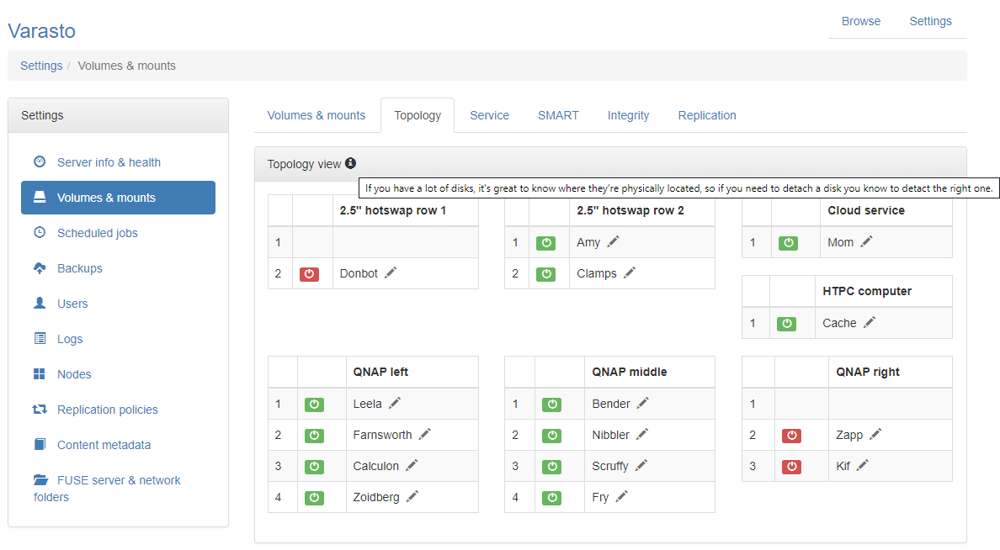
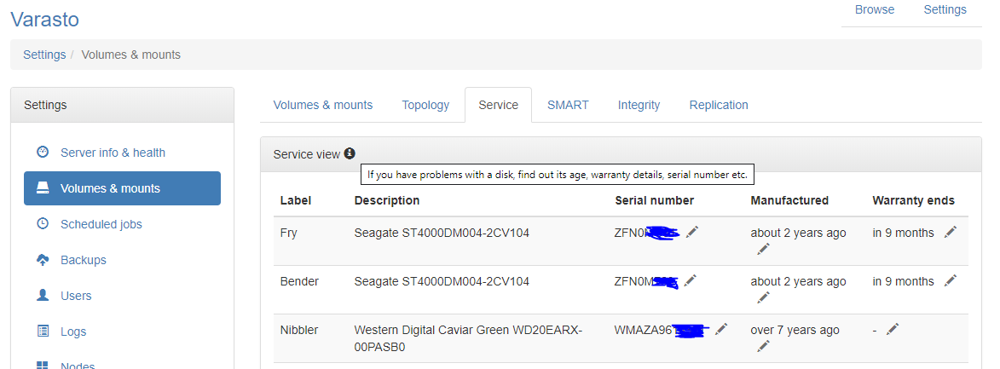
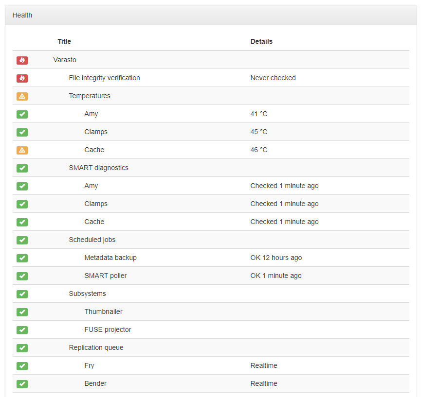
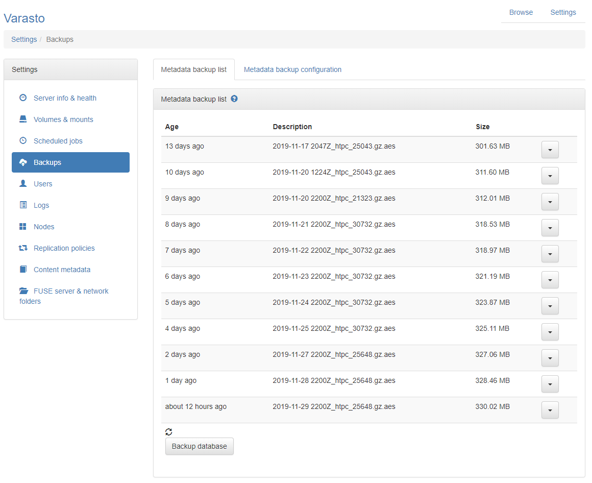

Screenshots
===========

Media: movies
-------------

Show

Media: TV shows
---------------

Show

Volumes & mounts
----------------

Show

Disk topology view
------------------

Show

Disk service view
-----------------

Show

SMART monitoring
----------------

Show

Health monitoring
-----------------

Show

Backups
-------

Show

Clients
-------

Show

Replication policies
--------------------

Show

Testing rig
-----------

Varasto is being tested on a server with a direct attach storage enclosure with 8 hot-swap
bays, but you could just as well run Varasto on a NAS or even on a regular computer with
internal drives.

Show

