Web UI
------

### Generic files

!!! note ""
	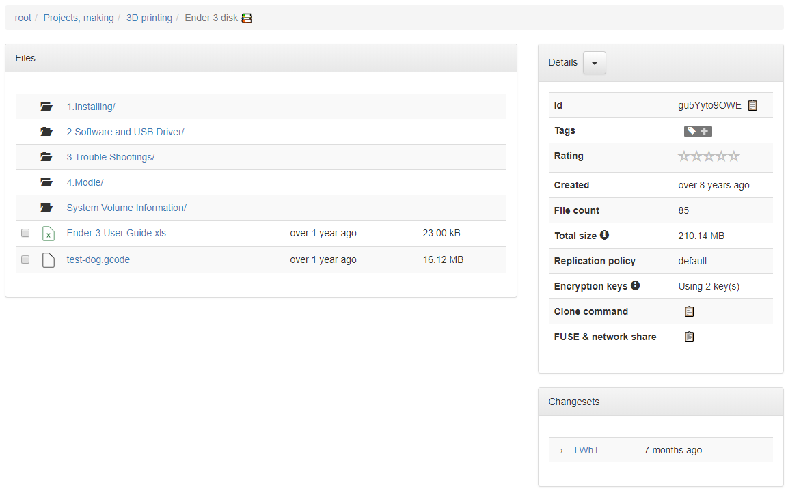

### Movies

!!! note ""
	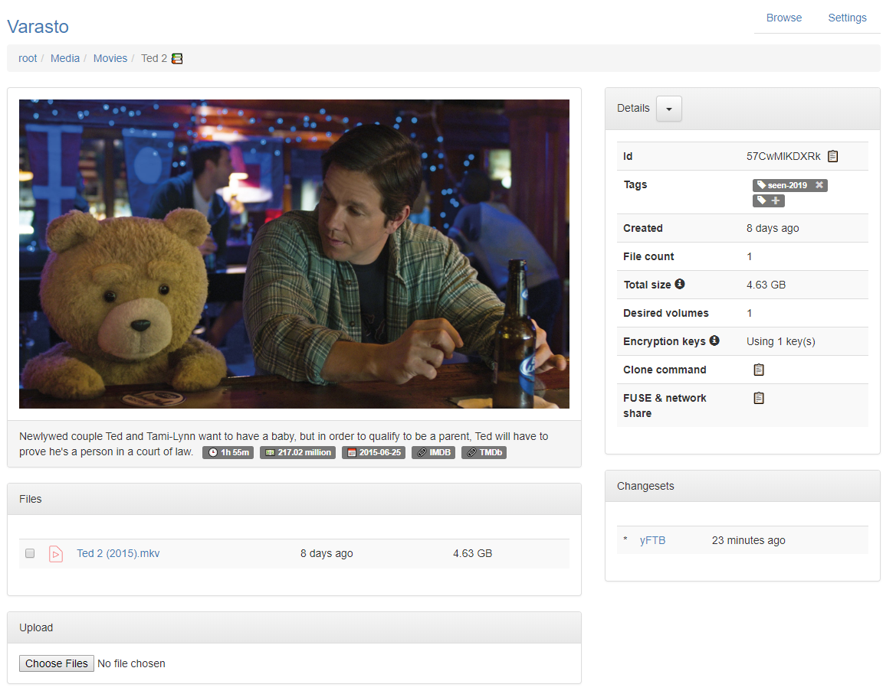

### TV shows

!!! note ""
	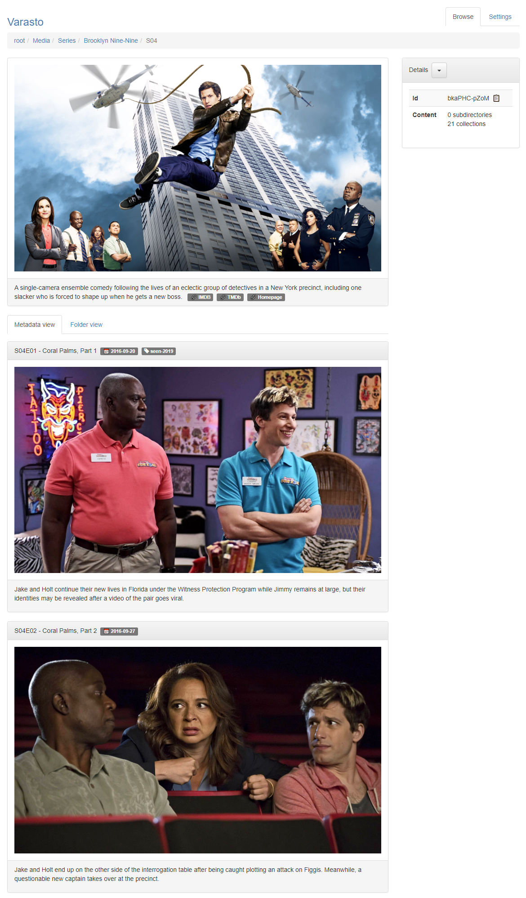

### Photos

!!! note ""
	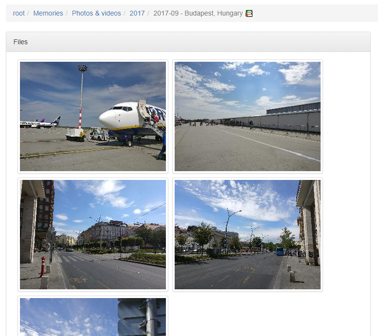

### Games

!!! note ""
	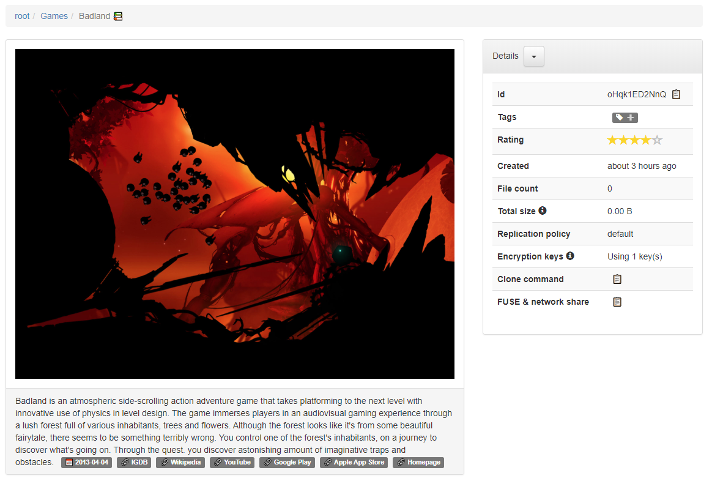

Other ways to access your data
------------------------------

### As network folders

You can access the [network folders](../data-interfaces/network-folders/) ("samba shares")
through Windows, Linux, macOS, apps for Android, iOS etc..

!!! note ""
	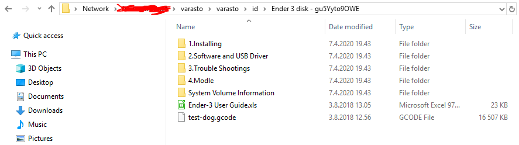

### Via FUSE filesystem

Linux users can treat all content in Varasto as if it was their local filesystem, even
when Varasto's content wouldn't fit in that computer's storage (the files will be streamed
on-demand). [Read more](../data-interfaces/network-folders/#architecture-how-does-it-work).

!!! note ""
	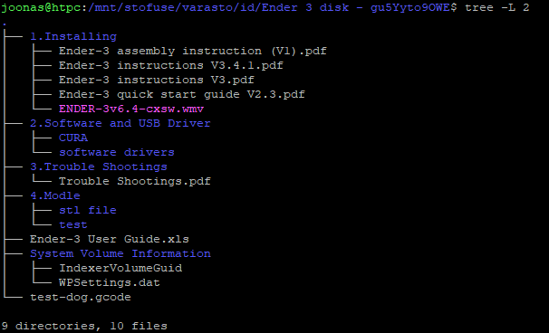

### Cloning of collection

See [short video & read more](../data-interfaces/client/).

Administration
--------------

### Volumes & mounts

!!! note ""
	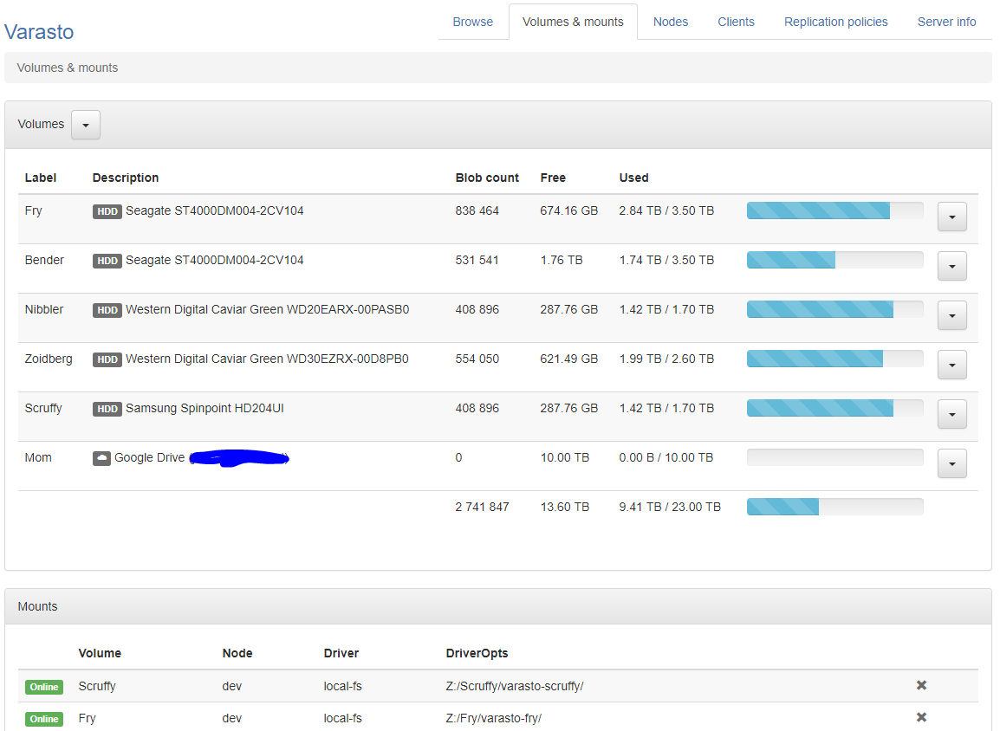

### Disk topology view

!!! note ""
	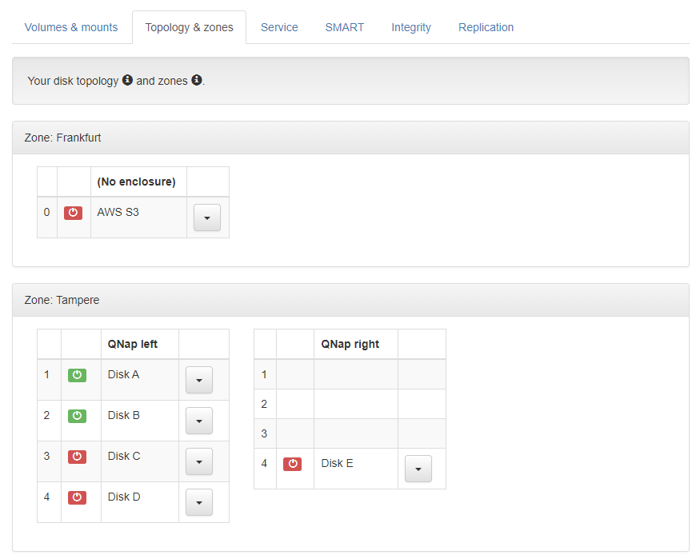

### Disk service view

!!! note ""
	

### SMART monitoring

!!! note ""
	

### Data integrity verification

!!! note ""
	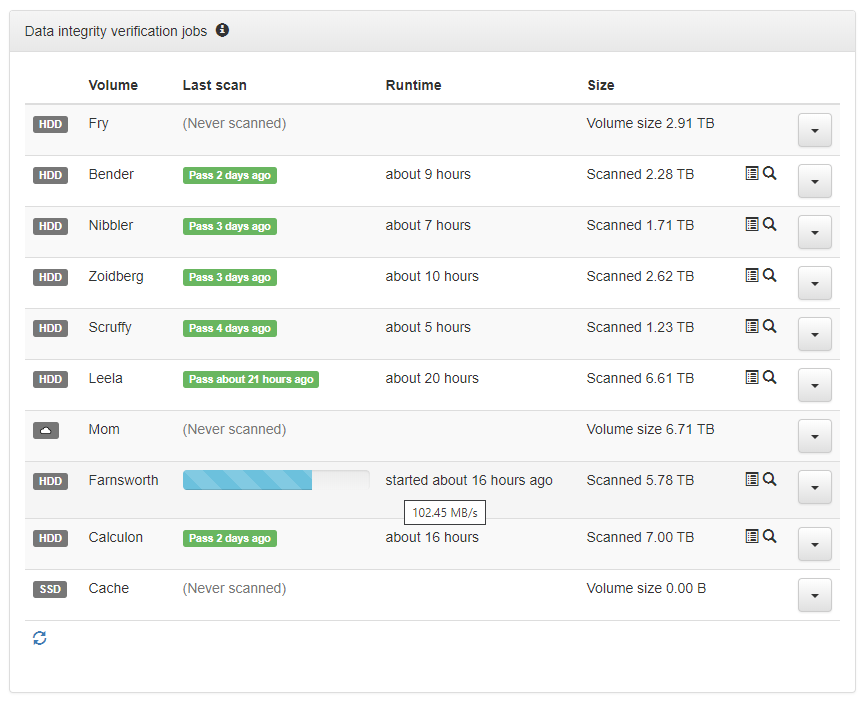

### Health monitoring

!!! note ""
	

### Metadata backups

!!! note ""
	

### Replication policies

!!! note ""
	

### Replication queue

!!! note ""
	

### Observability (Prometheus metrics)

!!! note ""
	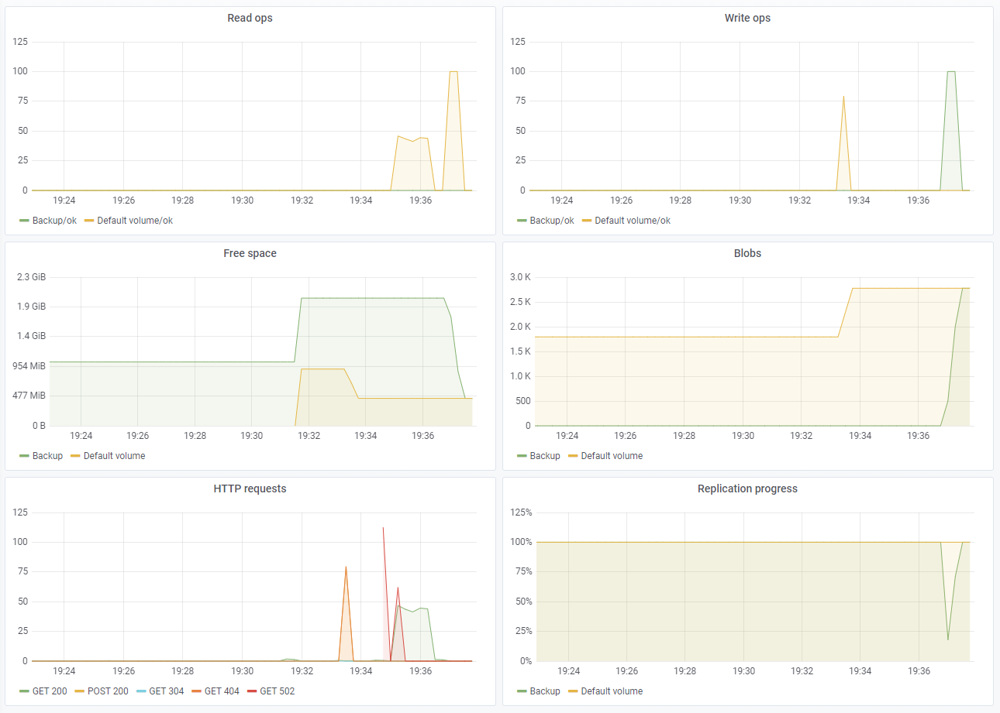

### Clients

!!! note ""
	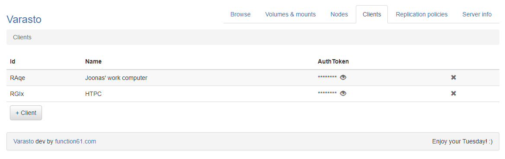

Other
-----

### Testing rig

Varasto is being tested on a server with a direct attach storage enclosure with 8 hot-swap
bays, but you could just as well run Varasto on a NAS or even on a regular computer with
internal drives.

!!! note ""
	
