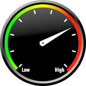
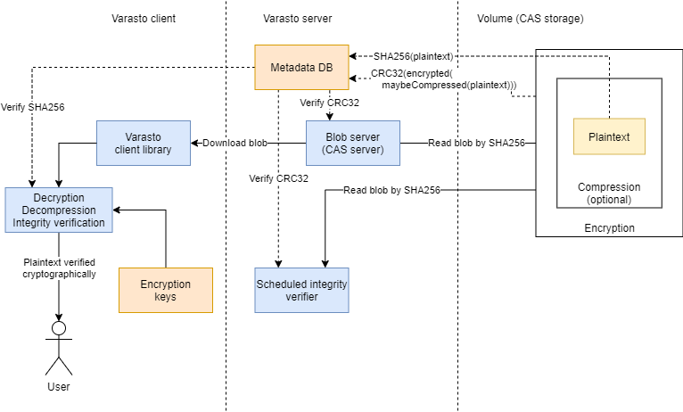

Summary: configurable security
------------------------------

You can configure the "security dial" of Varasto between maximum convenience and maximum
security - even on a per-directory-tree basis.

(The **data on disk is always encrypted with strong encryption**, but how the data encryption
keys are accessible is configurable for convenience.)



For most casual users you don't even necessarily have to understand about these security
mechanisms. Varasto can do the best it can without getting in the way by configuring
easy-to-use defaults - the security will still be comparable to full-disk encryption solutions.

If you are interested in improving the security beyond baseline, read on!


Glossary
--------

!!! tip
	Locating these terms in the diagram below will make understanding easier!

| Term                           | Meaning |
|--------------------------------|---------|
| DEK (Data Encryption Key)      | Encryption key used to encrypt actual files |
| KEK (Key Encryption Key)       | Encryption key used to encrypt other encryption keys - DEKs in our case |
| HSM (Hardware Security Module) | Varasto can optionally use a HSM to securely store KEKs in a way that the KEK cannot be stolen |
| Key envelope                   | DEK is encrypted/wrapped inside an envelope in a way that only the KEK can decrypt the DEK. I.e. KEK (and by extension, optionally the HSM) controls access to data. |

You can read more about above concepts at
[Google KMS](https://cloud.google.com/kms/docs/envelope-encryption). (Google has nice docs
on this, but we're not Google specific)


Overview
--------


Each collection in Varasto has a different DEK, so compromise of one collection does not
compromise other collections. The DEKs are stored in Varasto's database.

If an attacker steals your encrypted files *and* Varasto's database or gets access to it,
she could steal all DEKs to be able to decrypt **all your data**.

To protect from this, we encrypt the DEKs with a KEK within a "key envelope" - one envelope
for each of your KEK. This way a given DEK can be decrypted by having any *one* of your KEKs.

This way even if we have millions of collections with millions of DEKs, we can have all of
them protected with about two "root" KEKs that can be stored in a high-security place with
auditing and/or physical key press to grant access to just one collection at a time.


HSM or not?
-----------

For casual users we can keep the private portion of the KEK stored inside Varasto so you
can fiddle with your files without being asked to do anything.  

For more advanced users the private portion of KEKs can be stored in HSMs so that any data
in Varasto can only be read by asking the HSM to decrypt the DEK.

You can also mix-and-match security levels by having in-Varasto KEK for your less
private data and HSM-backed KEKs for your more private data.

| Data security | KEK in HSM | Bulletproof auditing | Touch-to-decrypt | Convenience |
|---------------|------------|----------------------|------------------|-------------|
| Low           | ☐          | ☐                   | ☐               | High        |
| Medium        | ☑️         | ☑️                  | ☐               | Medium      |
| High          | ☑️         | ☑️                  | ☑️              | Low         |

Bulletproof auditing = if your HSM is on a dedicated server with almost nothing but the
HSM and the auditing running, it'd be pretty hard for an attacker to bypass the auditing.

You can even have touch-to-decrypt for your employees' machines by having a
[YubiKey](https://www.yubico.com/) or similar generate a "I approve requesting the
remote-stored KEK to grant me access to these files" -signature which will be relayed to
the HSM service to authorize the DEK decryption.


Why do I need at least two KEKs?
--------------------------------

### Why

Remember, a KEK unlocks all your DEKs. If you only have one KEK and lose it:

- => you lose the DEKs (since they're encrypted with the lost KEK)
- => you lose access to your files (since accessing the data requires the DEK)

HSMs can break or be stolen, so you can lose a KEK. Therefore we recommend you to always
have **at least** one backup KEK so you won't lose your files.

You can unlock a given DEK with any one of your KEKs.

### Backup KEKs

The backup KEK can be:

- another HSM if you need high availability or want zero (or minimal) downtime if your primary HSM fails
- or if you don't mind some downtime when a HSM fails, you can store your backup key offline on paper or inside a flash drive etc.

### What about backing up DEKs?

You don't need to worry about backing up DEKs, because they're stored in Varasto's database
and that DB is covered by Varasto's DB backup mechanism.


Algorithms used
---------------

### DEK

Your files are encrypted with a 256-bit DEK that encrypts with AES in CTR mode with a
unique IV that is never reused due to it being the plaintext content hash and Varasto's CAS
nature stores each unique content blob only once.

### KEK

KEKs use public key crypto (RSA-OAEP) to asymmetrically wrap ("key envelope") the DEKs.
This means that if you store the private portion of the KEK outside of Varasto (a HSM maybe),
Varasto itself can't even access the files that you store.

EC support is being researched but
[might not be feasible](https://blog.filippo.io/using-ed25519-keys-for-encryption/).


Limitations of Varasto's crypto design
--------------------------------------

Since `SHA-256` of plaintext is stored in the database, some knowledge is leaked: if someone
already has the file that you have stored, they can compute the hash and see that you have
the same hash, i.e. know that you have the same file.

This means Varasto is not great for you if you have data that also other people have and
you want to have the ability to deny those people that you have the same data as they have.

Please note that this only applies if those people have access to your Varasto database.


Can I trust Varasto's encryption?
---------------------------------

!!! tip "Summary"
	We've provided an OpenSSL command to decrypt a file that Varasto has encrypted. If you
	trust OpenSSL and the parameters we give it (and our rationales), you can trust Varasto's
	implementation.

### Plaintext file

I stored a picture of a kitten, [plaintext.jpg](./plaintext.jpg), in my Varasto installation.

The file is under 4 MB, so it got stored as a single blob. The blob's (and in this case,
whole file's) `sha256(plaintext)` is
`b2b0d7f8c66c11ae1355a7f240ec6fe421a71f77fa3022c032783a39bdfb14cb`.


### Encryption key

The collection the blob was stored in, got assigned DEK
`fc5832fa18c5d2534c8a387b90e83ced6dc987dfb0a98bd3dceef0f36cc3e697` (256-bit AES key).

??? question "Was the key generated in a safe manner?"
	You can [audit the calling code here](https://github.com/function61/varasto/blob/8e7f6663b7051c966445582235d261f698bf31fe/pkg/stoserver/commandhandlers.go#L601).

	([crypto/rand.Read](https://pkg.go.dev/crypto/rand?tab=doc#Read) is safe for
	cryptographic use.)


### On-disk encrypted file

I copied the on-disk encrypted blob here as [ciphertext.bin](./ciphertext.bin).

??? question "Where did I find the encrypted file from?"
	My instance had it stored in `/mnt/varastotest/m/ao/dfu66dg8qs4qlkvp41r3fsggqe7rnv8o25g1if0t3jffr2j5g`.

	The path is lowercased [base32 extended alphabet](https://cryptii.com/pipes/base32hex)
	of the sha256 hash.

	Why base32? It takes less disk space than hex encoding, but we can't use base64 because
	it contains mixed case letters and unfortunately we have to support Windows (which has
	largely a case insensitive filesystem).


### OpenSSL command for decrypting a file encrypted by Varasto

| Detail | Value |
|--------|-------|
| Cipher | AES-256 |
| Mode of operation | CTR |
| DEK | fc5832fa18c5d2534c8a387b90e83ced6dc987dfb0a98bd3dceef0f36cc3e697 |
| IV  | b2b0d7f8c66c11ae1355a7f240ec6fe4 (first half of `sha256(plaintext)`, 128 bits) |

??? question "Is CTR a safe mode?"
	See a good video on [encryption modes](https://www.youtube.com/watch?v=Rk0NIQfEXBA).

	CTR can be unsafe if you don't authenticate the data - that's why there's more modern
	mode GCM, but we chose not to use it because GCM uses more disk space (CTR gives us
	nice 1:1 on lengths of plaintext and ciphertext) and **we already do authentication** due
	to our [CAS design](../../concepts-ideas-architecture/index.md#content-addressable-storage),
	so ciphertext tampering wouldn't go unnoticed.

??? question "Is the IV safe?"
	A secure IV can be public knowledge but must never be reused (so usually a random
	source is used). Since we use `sha256(plaintext)` as IV, it's guaranteed to not be
	reused because due to our CAS nature we only store each unique hash (and by extension,
	IV) once.

	See Crypto StackExchange on
	[Is it safe to use file's hash as IV?](https://crypto.stackexchange.com/questions/3754/is-it-safe-to-use-files-hash-as-iv).

	Also see
	[Is Convergent Encryption really secure?](https://crypto.stackexchange.com/questions/729/is-convergent-encryption-really-secure):

	> If it's implemented properly, it is as secure as any other form of encryption in
	> preventing those who don't know the data from obtaining it from the encrypted data.
	> However, it does have one fundamental limitation that, so far as we know, is inherent
	> in the technology -- Anyone who has the same file you have can potentially prove that
	> you have that file.

	The above limitation is already present by design in every CAS-based system.

	The IV is 128 bits because that's AES's block size and what the CTR mode requires.

Plucking in the values from the above table, we get this `openssl` command:

```console
$ openssl enc -aes-256-ctr -d \
	-iv b2b0d7f8c66c11ae1355a7f240ec6fe4 \
	-K fc5832fa18c5d2534c8a387b90e83ced6dc987dfb0a98bd3dceef0f36cc3e697 \
	-in ciphertext.bin \
	-out plaintext-decrypted-from-varasto.jpg
```

Does the decrypted file match the original plaintext?

```console
$ sha256sum plaintext.jpg plaintext-decrypted-from-varasto.jpg
b2b0d7f8c66c11ae1355a7f240ec6fe421a71f77fa3022c032783a39bdfb14cb  plaintext.jpg
b2b0d7f8c66c11ae1355a7f240ec6fe421a71f77fa3022c032783a39bdfb14cb  plaintext-decrypted-from-varasto.jpg
```

They match. You can download the `ciphertext.bin` and `plaintext.jpg` from this article to
test it yourself.


### Recap

Since the original plaintext and OpenSSL's decryption results match, you can trust Varasto's
encryption implementation if you:

- Trust AES-256-CTR as a good cipher and mode
- Trust OpenSSL's implementation of AES-256-CTR
- Trust Varasto's encryption key generation
- Trust Varasto's IV selection

We have given explanations to these selections and places/tools for you to audit them yourself.


What if my HSM gets stolen?
---------------------------

Since the HSM grants access via the KEK to all the DEKs, an attacker stealing the HSM
(and your encrypted data) would enable decryption of all your files. We recommend using a
HSM that only grants access to the KEK after a PIN is entered. This way if an attacker
steals the HSM she can't use the KEK without unlocking the HSM first with a PIN.

Remember to safeguard your backup KEKs as well as your primary KEK - your security is only
as strong as your weakest link.


How does integrity verification work with encrypted content?
------------------------------------------------------------

!!! tip "Read first"
	Read on
	[what a CAS is](../../concepts-ideas-architecture/index.md#content-addressable-storage).


### Integrity verification in a generic CAS system

With a generic CAS, one can verify integrity by checking that the file content matches
the hash it was stored under - i.e. our integrity verifier could use the `SHA-256` hashes.
Nice and simple.

Things get a little more complicated **if we want** encryption, deduplication and for
[file scrubbing](../../using/background-integrity-verification/index.md) to be possible without
access to the encryption keys.


### Integrity verification in an encrypted, deduplicated CAS system

We have two different perspectives for integrity verification, with their minimal requirements:

|          | User accesses a file | [File scrubbing](../../using/background-integrity-verification/index.md) |
|----------|----------------------|----------------|
| Detect drive I/O errors | ☑️ | ☑️ |
| Detect bit rot          | ☑️ | ☑️ |
| Detect tampering        | ☑️ | ☐ |
| (cryptographically secure hash needed) | ☑️ | ☐ |

Given our use cases and requirements, here's a rough list of our options:

| Encryption | Deduplication[^1] | Scrubber works w/o encryption keys | CAS address | Scrubber checks |
|-----------------|-------------------|--------------------------------|-----------------|--|
| ☐ | ☑️ | n/a | plaintext | (CAS address) |
| ☑️ | ☑️ | ☐ | plaintext | (CAS address) |
| ☑️ | ☐ | ☑️ | ciphertext | (CAS address) |
| ☑️ | ☑️ | ☑️ | plaintext | `CRC32(ciphertext)` |

Since we want to tick all the boxes (encryption, deduplication and scrubbing without
encryption keys), we're left with having to have a separate hash, for scrubber's use,
based on the ciphertext.

Why `CRC32`? Because it's much cheaper than `SHA256` (would've been more consistent though)
and it doesn't have to be a cryptographic hash capable of detecting tampering - because it'll
be verified when an actual user accesses the file:




[^1]: If our CAS used ciphertext hash as address, we'd lose deduplication because quality
      ciphertext is always indistinguishable from randomness.
