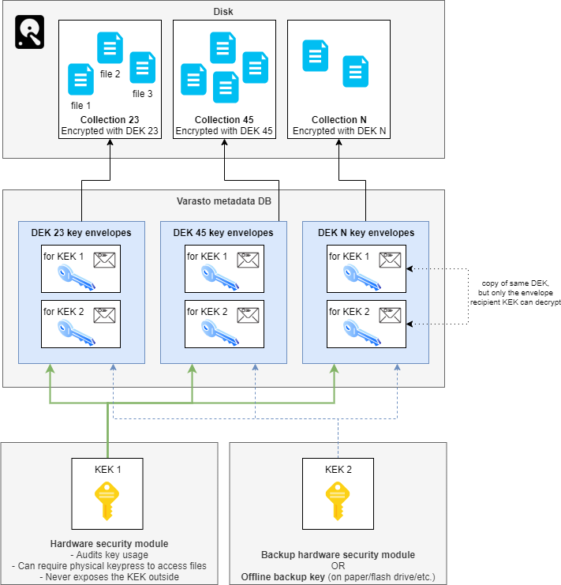

Encryption in Varasto
=====================

Contents:

- [Summary: configurable security](#summary-configurable-security)
- [Glossary](#glossary)
- [Overview](#overview)
- [HSM or not?](#hsm-or-not)
- [Why do I need at least two KEKs?](#why-do-i-need-at-least-two-keks)
- [Algorithms used](#algorithms-used)
- [Limitations of Varasto's crypto design](#limitations-of-varastos-crypto-design)
- [Varasto cryptosystem's description in minimal code](#varasto-cryptosystems-description-in-minimal-code)
- [What if my HSM gets stolen?](#what-if-my-hsm-gets-stolen)

Summary: configurable security
------------------------------

You can configure the "security dial" of Varasto between maximum convenience and maximum security.

For the most casual users you don't necessarily even have to understand about these security
mechanisms. Varasto can do the best it can without getting in the way by configuring
easy-to-use defaults - the security will still be comparable to full disk encryption solutions.

If you are interested in improving the security beyond baseline, read on!

Glossary
--------

NOTE: Seeing the below diagram will make following this easier!

| Term                           | Meaning |
|--------------------------------|---------|
| DEK (Data Encryption Key)      | Encryption key used to encrypt actual files |
| KEK (Key Encryption Key)       | Encryption key used to encrypt other encryption keys - DEKs in our case |
| HSM (Hardware Security Module) | Varasto can optionally use a HSM to securely store KEKs in a way that the KEK cannot be stolen |
| Key envelope                   | DEK is encrypted/wrapped inside an envelope in a way that only the KEK can decrypt the DEK. I.e. KEK (and by extension, optionally the HSM) controls access to data. |

You can read more about above concepts at
[Google KMS](https://cloud.google.com/kms/docs/envelope-encryption). (Google has nice docs
on this, but we're not Google specific)

Overview
--------

Each collection in Varasto has a different DEK, so compromise of one collection does not
compromise other collections. The DEKs are stored in Varasto's database.

If an attacker steals your encrypted files *and* Varasto's database or gets access to it,
she could steal all DEKs to be able to decrypt **all your data**.

To protect from this, we encrypt the DEKs with a KEK within a "key envelope" - one envelope
for each of your KEK. This way a given DEK can be decrypted by having any *one* of your KEKs.

This way even if we have millions of collections with millions of DEKs, we can have all of
them protected with about two "root" KEKs that can be stored in a high-security place with
auditing and/or physical key press to grant access to just one collection at a time.

HSM or not?
-----------

For casual users we can keep the private portion of the KEK stored inside Varasto so you
can fiddle with your files without being asked to do anything.  

For more advanced users the private portion of KEKs can be stored in HSMs so that any data
in Varasto can only be read by asking the HSM to decrypt the DEK.

You can also mix-and-match security levels by having in-Varasto KEK for your less
private data and HSM-backed KEKs for your more private data.

| Data security | KEK in HSM | Bulletproof auditing | Touch-to-decrypt | Convenience |
|---------------|------------|----------------------|------------------|-------------|
| Low           | ☐          | ☐                   | ☐               | maximum     |
| Medium        | ☑️         | ☑️                  | ☐               | medium      |
| High          | ☑️         | ☑️                  | ☑️              | minimum     |

Bulletproof auditing = if your HSM is on a dedicated server with almost nothing but the
HSM and the auditing running, it'd be pretty hard for an attacker to bypass the auditing.

You can even have touch-to-decrypt for your employees' machines by having a
[YubiKey](https://www.yubico.com/) or similar generate a "I approve requesting the
remote-stored KEK to grant me access to these files" -signature which will be relayed to
the HSM service to authorize the DEK decryption.

Why do I need at least two KEKs?
--------------------------------

### Why

Remember, a KEK unlocks all your DEKs. If you only have one KEK and lose it:

- => you lose the DEKs (since they're encrypted with the lost KEK)
- => you lose access to your files (since accessing the data requires the DEK)

HSMs can break or be stolen, so you can lose a KEK. Therefore we recommend you to always
have **at least** one backup KEK so you won't lose your files.

You can unlock a given DEK with any one of your KEKs.

### Backup KEKs

The backup KEK can be:

- another HSM if you need high availability or want zero (or minimal) downtime if your primary HSM fails
- or if you don't mind some downtime when a HSM fails, you can store your backup key offline on paper or inside a flash drive etc.

### What about backing up DEKs?

You don't need to worry about backing up DEKs, because they're stored in Varasto's database
and that DB is covered by Varasto's DB backup mechanism.

Algorithms used
---------------

### DEK

Your files are encrypted with a 256-bit DEK that encrypts with AES in CTR mode with a
unique IV that is never reused due to it being the plaintext content hash and Varasto's CAS
nature stores each unique content blob only once.

### KEK

KEKs use public key crypto (RSA-OAEP or ECDSA) to asymmetrically wrap ("key envelope") the DEKs.
This means that if you store the private portion of the KEK outside of Varasto (a HSM maybe),
Varasto itself can't even access the files that you store.

Limitations of Varasto's crypto design
--------------------------------------

Since sha-256 of plaintext is stored in the database, some knowledge is leaked: if someone
already has the file that you have stored, they can compute the hash and see that you have
the same hash, i.e. know that you have the same file.

This means Varasto is not great for you if you have data that also other people have and
you want to have the ability to deny those people that you have the same data as they have.

Please note that this only applies if those people have access to your Varasto database.

Varasto cryptosystem's description in minimal code
--------------------------------------------------

[TODO](https://github.com/function61/varasto/issues/134)

What if my HSM gets stolen?
---------------------------

Since the HSM grants access via the KEK to all the DEKs, an attacker stealing the HSM
(and your encrypted data) would enable decryption of all your files. We recommend using a
HSM that only grants access to the KEK after a PIN is entered. This way if an attacker
steals the HSM she can't use the KEK without unlocking the HSM first with a PIN.

Remember to safeguard your backup KEKs as well as your primary KEK - your security is only
as strong as your weakest link.
