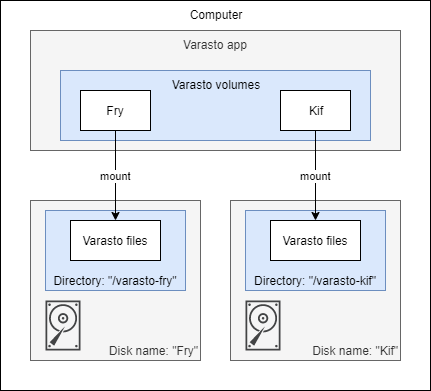

Conceptual overview
-------------------

Create one volume in Varasto for each disk you want to use with Varasto.




Which filesystem to store Varasto data on top of?
-------------------------------------------------

Varasto is not a filesystem in the traditional sense, even though it does very similar things.
Varasto only needs to write files and directories under a directory that you choose - that's it.

Varasto's local disk storage works with any filesystem that your OS supports. Use
whichever one you like! Our recommendations:

| OS      | Recommended FS |
|---------|----------------|
| Linux   | ext4           |
| Windows | NTFS           |
| Mac     | Whichever is the default |

Rationale: basically whichever one is the current safe choice without paying too much
overhead with extra features.

!!! info "Why not a safer filesystem?"
	Read: [But is ext4 / NTFS safe for my precious data?](#but-is-ext4-ntfs-safe-for-my-precious-data)


Creating & mounting a volume
----------------------------

Create a volume in Varasto which is basically just its name and a quota. The UI has
helpful advice.

I chose `Fry` for my volume name.

!!! tip
	Read: [Naming your volumes](../naming-your-volumes.md)

In this example I'm using Linux, and I have a dedicated partition at `/mnt/fry`.

We could have Varasto place its data at the root of the partition, but it's a good idea to
create a directory under which Varasto places its data, so that if/when any non-Varasto
files are placed on the partition, you know exactly which are Varasto's files.

I recommend naming the data directory `varasto-<volume name>` to be super clear.

Now we are ready to mount that directory as volume in Varasto! From Varasto choose
`Fry > Mount local volume`. Enter as path: `/mnt/fry/varasto-fry`.

!!! tip
	The directory will be created at mount-time if it does not exist (but for safety only
	if the volume is mounted for the first time).

That's it! Now that the volume is mounted, Varasto can write files there.


Do I need a dedicated partition for Varasto volume?
---------------------------------------------------

No, but it's cleaner to dedicate a partition for a Varasto volume.

If you use the same partition for Varasto and other use, it's difficult to define the
quota you want for your Varasto data if you don't know in the long term how much space is
left for Varasto to actually use.

If you want to just test Varasto, by all means just make a directory for Varasto in your
existing partition and start testing! If you like it and want to keep using it, you can
easily move the data later to a separate partition/disk without reinstalling Varasto.


But is ext4 / NTFS safe for my precious data?
---------------------------------------------

| OS      | "Unsafe" FS | "Safer" FS |
|---------|-------------|------------|
| Linux   | ext4        | ZFS, Btrfs |
| Windows | NTFS        | ReFS       |

There are "safer" alternatives to `ext4` and `NTFS`. While you can use those, we don't
recommend them because they have overheads like:

- integrity verification
- configurable replication
- file compression
- and maybe even encryption

Varasto already implements these! You'd pay the overhead twice and get additional complexity
without gaining anything.

!!! tip
    Varasto builds safety on top of unsafe filesystems.


More details for nerds
----------------------

When Varasto mounts a volume for the first time, it writes the volume ID in a "volume descriptor" file:

```console
$ tree /mnt/fry/varasto-fry
`-- 0
    `-- 00
        `-- 0000000000000000000000000000000000000000000000000
```

We can inspect its content:

```console
$ cat /mnt/fry/varasto-fry/0/00/0000000000000000000000000000000000000000000000000
{
    "volume_uuid": "VaLnZHPzHaY"
}
```

This is the only file that Varasto writes there in un-encrypted form. This file is used
to ensure that you don't accidentally mount the wrong volume's files (which could have
disastrous consequences because that would mess up bookkeeping).

When I add content in Varasto, more files will appear in the above hierarchy:

```console
$ tree /mnt/fry/varasto-fry
|-- 0
|   `-- 00
|       `-- 0000000000000000000000000000000000000000000000000
`-- p
    `-- g5
        `-- dt8hr0to76a4236tmtuaaer6qith92crjir214snsihdlfmu0
```

!!! info
	The reason Varasto creates subdirectories is so that we won't end up having too many
	files in any one directory (most filesystems would slow down).

Each filename is a hash of its content (except the volume descriptor). Read more about
[our Content-Addressable-Storage](../../concepts-ideas-architecture/index.md#content-addressable-storage)
("CAS").

This same CAS-concept is used for all Varasto blob drivers like cloud disks, but some
details may vary - e.g. most cloud drivers tend not to benefit from a subdirectory
structure due to how their service is architected.
