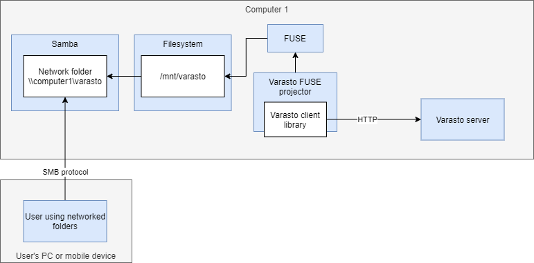

Motivation
----------

Network folders are great when you just need to access the raw files, but you'd prefer to
stream them without downloading ("cloning") them to your computer.

OS support
----------

| Component              | Linux | Windows | Mac | Android, iOS |
|------------------------|-------|---------|-----|--------------|
| Varasto server         | ☑    | ☑     | ☑ | ☐           |
| Access network folders | ☑    | ☑     | ☑ | ☑          |
| Serve network folders  | ☑    | ☐      | ☐  | ☐           |
| Varasto FUSE projector | ☑    | ☐      | ☐  | ☐           |

`Serve network folders` requires `Varasto FUSE projector` (= their rows are identical).
Therefore currently you need Linux to share data from Varasto as network folders.

!!! tip
	You can still serve network folders even if you run Varasto server on e.g. Windows by running
	the FUSE projector on a Linux machine (or VM) - they support communicating over a network.

Architecture / how does it work?
--------------------------------

Network folders are built on top of Varasto's FUSE interface -
[read about its architecture first](../fuse-interface/index.md#architecture).

As mentioned in the above document, the directory hierarchy exposed by the FUSE projector
is only accessible on the computer the projector runs on. But we can use Samba to export
it as a network folder ("network share").

Here's how it looks if you run Varasto server and Varasto FUSE projector + Samba on:

=== "The same computer"
	

=== "Different computers"
	

Set up FUSE projector
---------------------

As network folders builds on top of FUSE projector, [go set it up first](../fuse-interface/index.md)!

!!! tip
	Before moving on to configure Samba, test that the FUSE projector works (its page has
	instructions).

Exporting Varasto via Samba
---------------------------

Varasto doesn't bundle a Samba server because you might already be running a Samba server
configured to your liking. And if you're using Varasto on Docker, it really goes against
containerization philosophy to run two unrelated services inside one container.

### I already have Samba

All that's left is that you just configure it to export `/mnt/varasto`.

### I don't already have Samba

If you're using Docker with Varasto (recommended option!), you could use my
[joonas-fi/samba](https://github.com/joonas-fi/samba) image that I also use to successfully
export Varasto and more.

If you're not using Docker, there's many good tutorials online for setting up Samba.

Access from mobile devices
--------------------------

### VPN

It's easy to access your network folder when your mobile device (e.g. an Android phone) is
connected via Wifi to the same network as your Varasto server.

What if you want to access your data on-the-go, e.g. from a 4G network? That's where VPN
products come in - their job is to "teleport" your device into the same network where
Varasto server is.

There are plenty of free VPN solutions to choose from - we've had great experience with
[WireGuard](https://www.wireguard.com/).

!!! tip
	[Tailscale](https://tailscale.com/) (free) uses WireGuard internally and makes WireGuard even
	easier to use - especially when adding more devices to your network.

### Which app to access network folders

There are plenty of apps offering this functionality. A few promising ones:

| OS      | App              |
|---------|------------------|
| Android | [Cx File Explorer](https://play.google.com/store/apps/details?id=com.cxinventor.file.explorer) |
| iOS     | [FE File Explorer](https://apps.apple.com/au/app/fileexplorer-file-manager/id510282524) |
