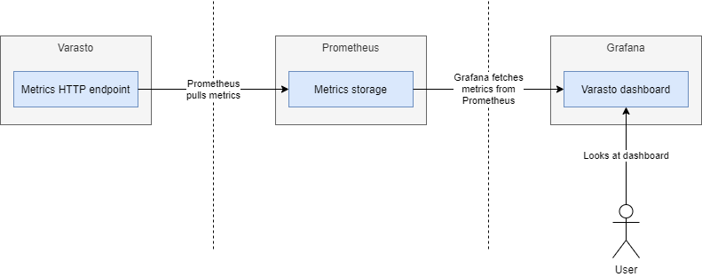

Observe how Varasto is doing from key metrics like:

- Per-volume:
	* Used and free space
	* Blob count ("file chunk count")
	* Read/write requests, errors and byte counts
	* Replication progress
- HTTP server request counts partitioned over status code and method
- Scheduled job durations

Prometheus
----------

Varasto has [Prometheus](https://prometheus.io/)-compatible metrics. Prometheus does not
offer built-in dashboards, but there are many dashboarding solutions that can read data off
of Prometheus.

Grafana
-------

[Grafana](https://grafana.com/) is our recommendation for building dashboards from metrics
in Prometheus (the example screenshot is from Grafana).

Here's how the whole looks:

Embed Grafana in Varasto
------------------------

We also support embedding Grafana dashboard in Varasto's admin panel for quick access:

<iframe width="688" height="387" src="https://www.youtube.com/embed/EgX898fGz4U" frameborder="0" allow="accelerometer; autoplay; encrypted-media; gyroscope; picture-in-picture" allowfullscreen></iframe>

!!! tip
	You need to enable
	[allow_embedding](https://grafana.com/docs/grafana/latest/installation/configuration/#allow-embedding)
	in Grafana's config.
