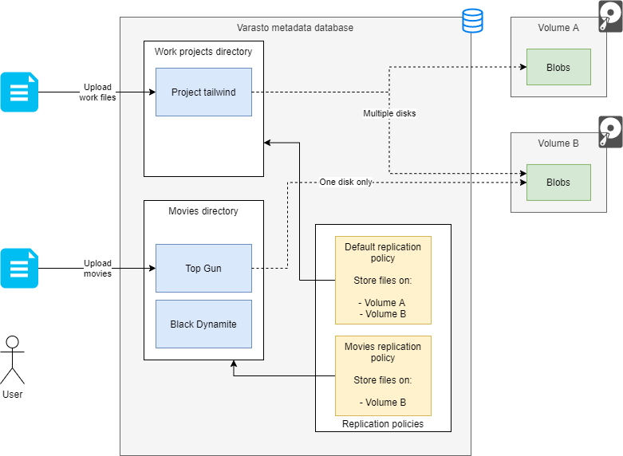
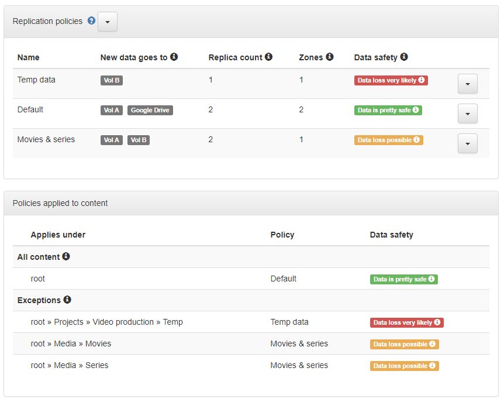
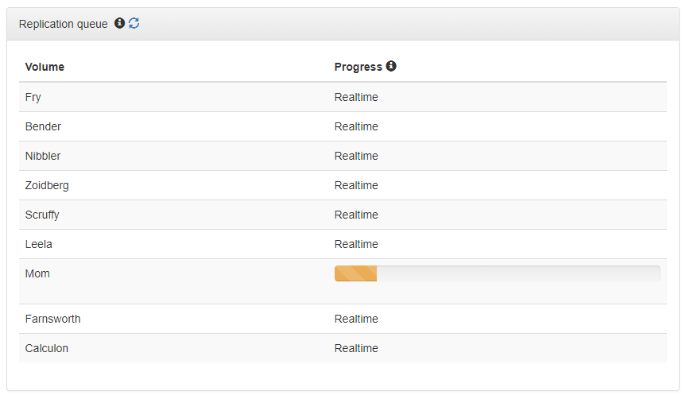

What does it do?
----------------

A replication policy specifies on which volumes a collection's files should be stored on.

NOTE: Above drawing's policy differs from screenshots below.

Screenshots
-----------

### Replication policies

### Replication queue

Reconciliation process
----------------------

When you make changes to your policies, your existing data can conflict with the desired
state of the updated policy. This will cause policy conflicts, which Varasto will fix by
replicating after confirming the fixes with you.

This process is currently better explained in the
[moving large amounts of data](../moving-data/index.md) -guide.

Do I need multiple policies?
----------------------------

If all of your data is equally important, then you need only one policy.

If you have data with varying types of importance, you can have for example:

- A default replication policy that saves data to three disks
	* The default policy is specified for root directory and is used for all file collections
	  unless a directory subtree explicitly specifies a different policy
- A policy for one subdirectory three (e.g. "All movies") for less important
  data that will be saved onto just one disk

