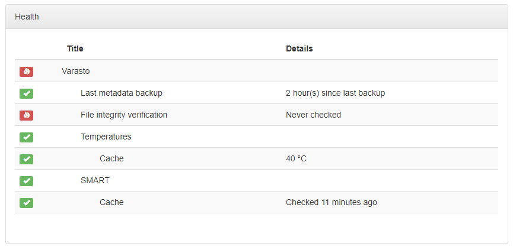

Motivation
----------

SMART can give warning signs of your storage device breaking before it totally fails.

You can also often get the temperature of the device so you can troubleshoot any airflow issues.

Screenshots
-----------

Supported OSes
--------------

| Feature          | Linux | Windows | macOS |
|------------------|-------|---------|-------|
| SMART monitoring | ☑    | ☐      | ☐    |

SMART support currently somewhat requires Docker - whether you're running Varasto inside
Docker or not (though you can work around it if you need to).

??? question "Why?"
	We need a fairly recent version of [smartmontools](https://www.smartmontools.org/)
	because we use JSON for easier interop and this new version doesn't seem to be in major
	Linux distros yet. If you're confident you have the right version and don't want to use
	Docker at all, you can change the backend (see troubleshooting section).

Configuration
-------------

Not all volumes can be checked for SMART data - cloud volumes and other external services
are one such example where the concept does not apply.

You have to specify "SMART ID" for each volume that supports polling their SMART data.

The "SMART ID" is an ID with which the SMART subsystem will identify the disk. In practice
it's the device path to the Linux block device like `/dev/sda`.

It's recommended to use paths under `/dev/disk/by-uuid/..` to explicitly specify which disk
you're referring to, since `/dev/sda` could very well be `/dev/sdb` on next boot.

You can enter "SMART ID" in `Volumes & mounts > SMART > Configuration > Set SMART ID`.

Once you've entered the ID, the row doesn't automatically show up in the SMART tab - it only
shows up after the first SMART report is polled for this disk.

You can start poll from the SMART tab's "SMART scan" button - after that you should see the 
SMART data row and also now see the volume in server health page.

Troubleshooting
---------------

### Smart backend

Because our SMART support works whether you're inside a container or not, the SMART
backend is configurable. These backends are available:

| Backend             | Varasto invokes `$ smartctl` |
|---------------------|------------------------------|
| `SmartCtl`          | Directly                     |
| `SmartCtlViaDocker` | Via smartctl Docker image having the proper version |

Why is this important-seeming explanation in troubleshooting section? Because Varasto
auto-detects which backend to use when it starts for the first time - so for most users
this should "just work".

Auto-detection logic:

| Inside a container? | Chosen backend | Rationale |
|---------------------|----------------|-----------|
| No | `SmartCtlViaDocker` | Assume the host doesn't have the correct version of smartctl installed |
| Yes | `SmartCtl`         | The right version of smartctl is baked-in to Varasto image |

If we got the autodetection wrong, you can change the backend in
`Settings > Servers > server > Change SMART backend`.
