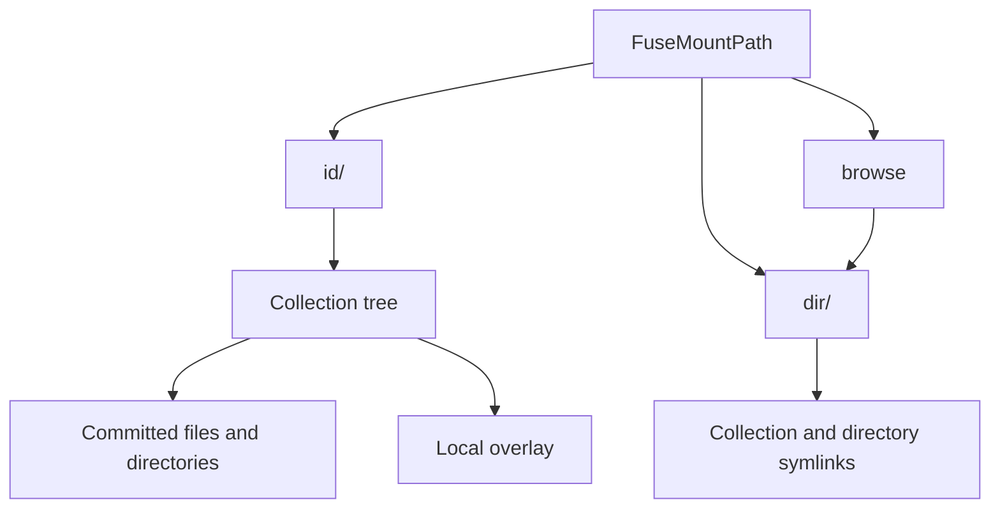
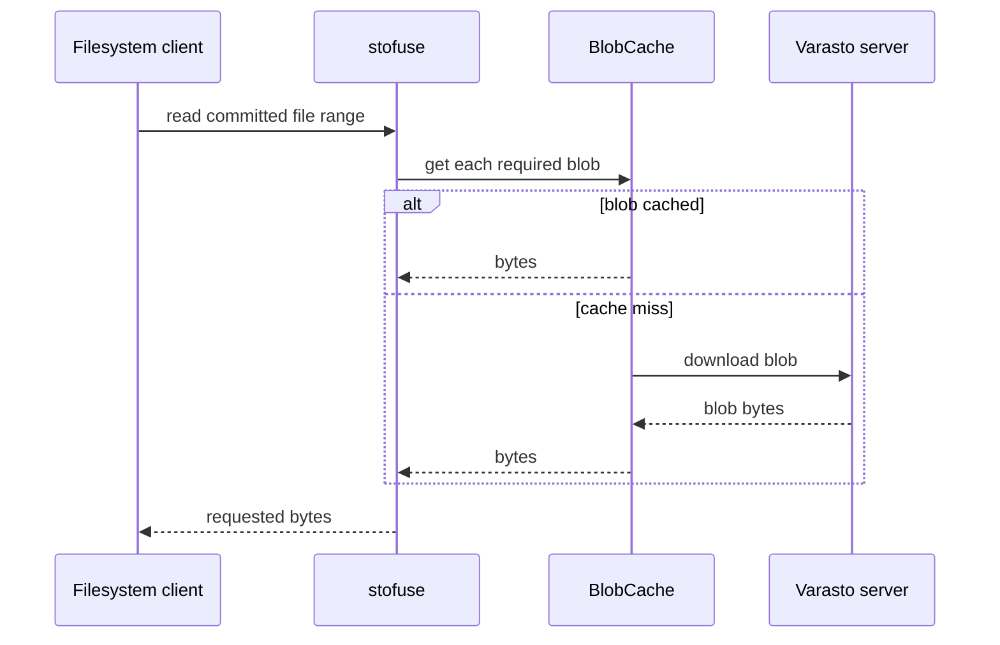
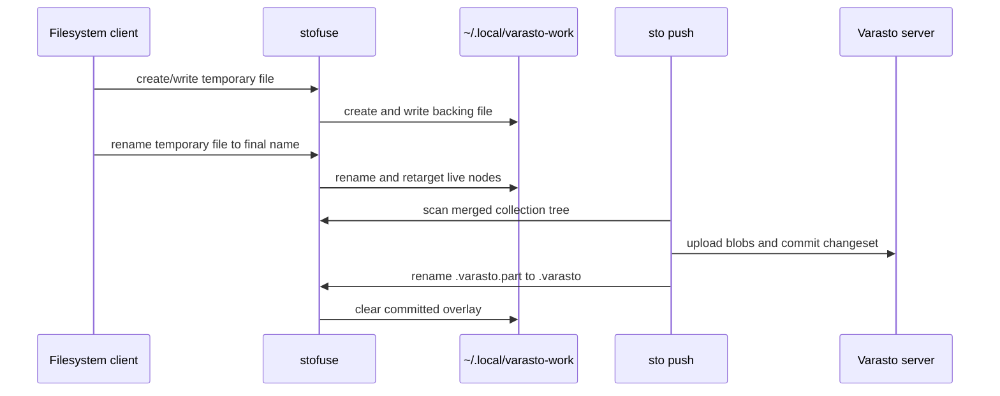

# Varasto FUSE Adapter

`stofuse` projects Varasto collections as a FUSE filesystem. It is a client-side
adapter: collection metadata and blobs come from the configured Varasto server,
while uncommitted changes are kept locally until `sto push` commits them.

Start it with:

```console
sto fuse serve
```

`FuseMountPath` must be set in the client configuration. See
[`docs/data-interfaces/fuse`](../../docs/data-interfaces/fuse/index.md) for user
setup instructions.

## Namespace



- `id/<collection-id>` fetches and caches a collection's metadata, then exposes
  its tree.
- `dir/<directory-id>` fetches a Varasto directory and exposes its collections
  and child directories as absolute symlinks back into this filesystem.
- `browse` is a symlink to Varasto's root directory ID.
- Collection roots expose a synthetic `.varasto` state file so the mounted
  collection is usable as a Varasto workdir.

The server mounts with `AllowOther` for Samba use. The FUSE mount itself is not
read-only, but committed files are presented as read-only nodes.

## Read Path

Committed file metadata is resolved from the collection's HEAD. Reads translate
the file's blob references into blob downloads. `BlobCache` keeps the ten most
recent blobs in memory and serializes concurrent downloads of the same blob.



## Write Overlay

Writes never upload directly from FUSE. Creating a file or directory writes to:

```text
$HOME/.local/varasto-work/<collection-id>/<path>
```

Overlay entries take precedence over same-named committed entries. This allows a
new overlay file to replace a committed file by renaming it over the old name.
The adapter tracks live overlay file and directory nodes, so a client can safely
use a temporary-file-then-rename pattern (for example, browser downloads).

Overlay handles use positional I/O and close on FUSE `Release`. File truncation,
permissions, timestamps, and extended attributes are forwarded to the local
backing file.



`sto push` performs the upload and commit. After the remote commit succeeds, it
atomically saves `.varasto` through `.varasto.part`. The adapter recognizes that
final rename, updates the synthetic state file, clears the local overlay, and
invalidates the collection cache.

## Supported Operations And Limits

Supported for overlay entries:

- Create, read, write, truncate, chmod, timestamp changes, and xattrs.
- Create directories.
- Rename files and directories, including across directories in the same
  collection.
- Remove uncommitted files.

Current limitations:

- Committed files cannot be modified in place; replace them through an overlay
  file and rename.
- Removing committed files and removing directories are not implemented.
- Cross-collection rename behavior is not a supported interface.
- The overlay is local process state. Do not treat it as a durable substitute
  for a successful `sto push`.

## Key Files

- `server.go`: mounts the filesystem and constructs the root namespace.
- `collectionadapter.go`: projects collection state, implements the overlay, and
  handles FUSE file operations.
- `collectionbyidquery.go` and `dirbyidquery.go`: metadata query nodes and
  caches.
- `blobcache.go`: remote blob download cache.
- `entrypoint.go`: `sto fuse` CLI commands.
